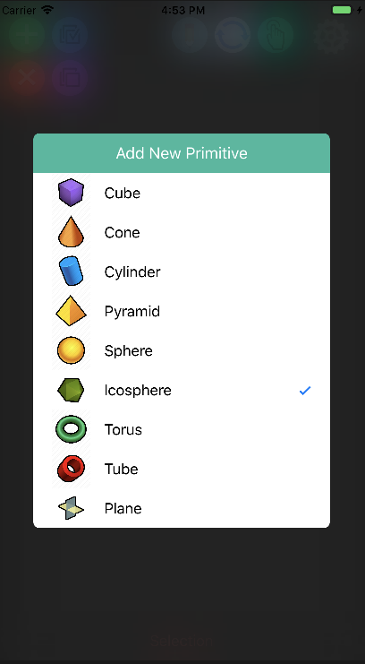
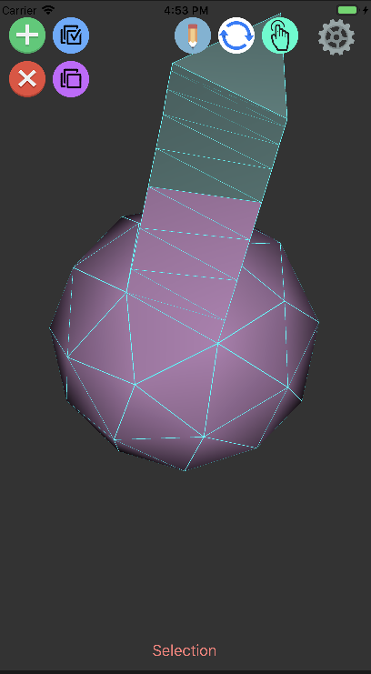

# SwiftModelEditor
A simple iOS application developed in Swift 3.2 using GLKit that can be used to create basic 3D models. This application was created as my final project in CS410 in Spring 2017. Due to time restraints, this model editor was only designed to perform a few basic functions. 

## Core Features
- Add new primitive
    - Nine procedurally generated primitives to choose from
- Delete selected
- Select All Faces
- Deselect All Faces
- Three modes of interacting with faces
    - Extrude
    - Rotate
    - Select
- App Settings
    - Antialiasing

 

## Built With

* [CZPicker](https://github.com/chenzeyu/CZPicker) - Popup picker view.
* [iOS InApp Settings TableView](https://github.com/KingIsulgard/iOS-InApp-Settings-TableView) - Clone of native Preferences for in app settings.
* [Procedural Primitives](http://wiki.unity3d.com/index.php/ProceduralPrimitives) - Code for generating primitives

## License
This project is licensed under Apache License 2.0 - See LICENSE.TXT for more info
